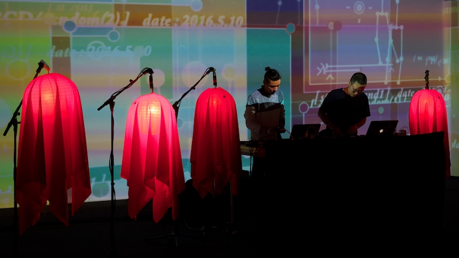
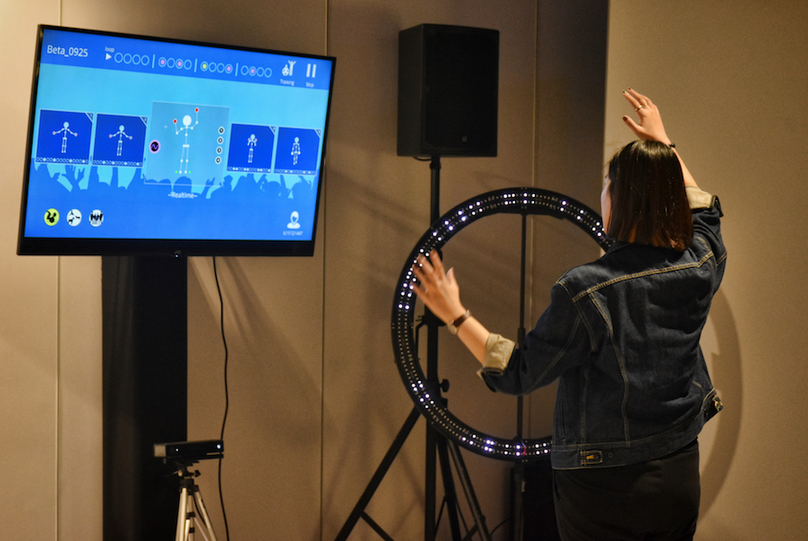

# Étude &middot; 

:art: :video_game: rehabilitation + art + performance, a new approach of art therapy.

It's prototyped in Processing.

## 0. Table of Contents  
- [Introduction](#1-introduction)
- [Links](#2-links)

## 1. Introduction

We set as a goal to bring back the victims of this incident their colorful youth and future through the expression of music, art, and technology. The goal of the process was to change the way rehabilitation feels for them. Since all of them were just starting to figure out their future, the rehabilitation process was very painful emotionally. The addition of the music and creativity content in their rehabilitation aimed to bring a more positive atmosphere to them. The whole process was recorded so it could be repeated for the society.

## 2. Links

- [Ars Electronica Festival 2017](https://www.aec.at/ai/en/etude/)
- [Click Festival 2017](http://www.clickfestival.dk/etude)
- [showcase in Taipei 2016](https://www.youtube.com/watch?v=zU01cFDjL6s)
